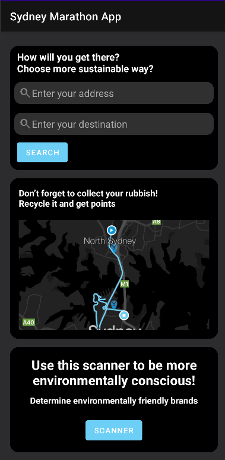
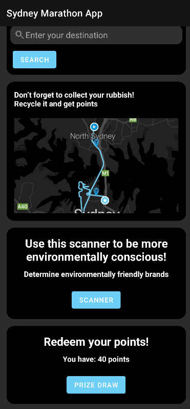
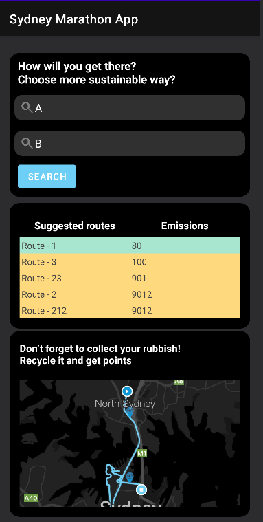
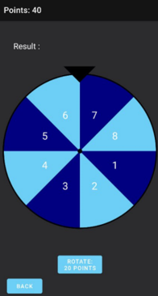

# Sydney-Marathon-Sustainability-App

This is a repository for a **TCS Sustainothon submission** by team Victorias Most Bitter. The solution is an Android mobile app written in Kotlin, designed for the Sydney Marathon to encourage the participants to make more environmentally-conscious decisions.

Google drive link with presentation and video - https://drive.google.com/drive/folders/1WJyLYO8zGvdJbuok5Ea1W7jLoclMypZf?usp=sharing

## Main screen
  

Contains a map to display an individual's route to the marathon, and custom made by inputting your starting address. Outputs several routes to get to the marathon, sorted in ascending order of carbon emissions of a certain route. Shows collection points for rubbish and clothing organized by TCS Integrates prize draw system based on points accumulated by users from recycling.

## Roulette screen

Offers prizes in exchange for recycling points determined by marathon sponsors.

## Barcode scanner

Scanning function for identifying environmentally friendly brands and producers.

## Reasoning
The design of the functions in our application replicated the idea of using a game like reward system to encourage participation.

These have been shown to be effective in promotion, being employed by companies such as McDonald's and Burger King (Hungry Jacks), with their use of famous games such as Monopoly and Uno to encourage participation from customers. We believe using games and prizes we can also encourage users to make more sustainable decisions, thus making the environmental impact of the Marathon much more mild. 
